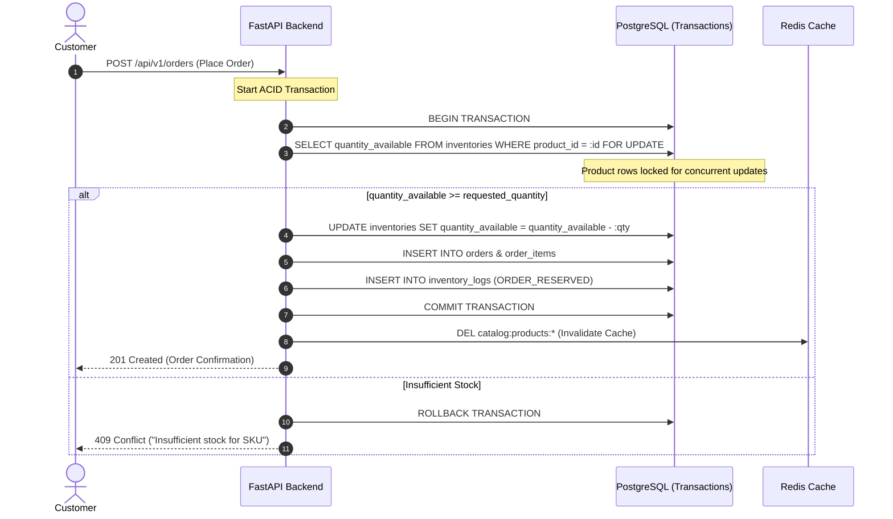
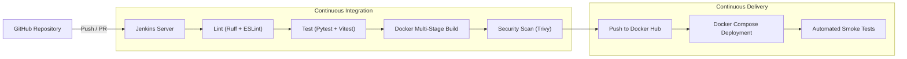

# ApexStore - System Architecture Specification

## 1. Architectural Philosophy

ApexStore is engineered as a **Modular Monolith** designed for developer velocity, ease of debugging, operational reliability, and clean separation of concerns. It deliberately avoids premature microservice overhead while maintaining clean boundaries between the presentation, application, caching, and persistence tiers.

---

## 2. System Topology

```mermaid
flowchart TD
    subgraph ClientTier["Client Tier"]
        C_User["Customer (Desktop / Mobile)"]
        C_Admin["Store Admin (Operations)"]
    end

    subgraph PresentationTier["Presentation Tier (Next.js :3000)"]
        FE_App["Next.js App Router"]
        FE_Storefront["Storefront (Browse, Cart, Checkout)"]
        FE_Admin["Admin Operations (Catalog, Stock, Orders)"]
        FE_State["Zustand State Management"]
        FE_App --> FE_Storefront
        FE_App --> FE_Admin
        FE_Storefront -.-> FE_State
        FE_Admin -.-> FE_State
    end

    subgraph ApplicationTier["Application Tier (FastAPI :8000)"]
        API_Router["REST API Gateway (/api/v1)"]
        MW_Auth["JWT & RBAC Middleware"]
        SVC_Catalog["Catalog & Category Service"]
        SVC_Inventory["Inventory & Concurrency Service"]
        SVC_Orders["Order & Checkout Processor"]
        SVC_Analytics["Admin Analytics Service"]

        API_Router --> MW_Auth
        MW_Auth --> SVC_Catalog
        MW_Auth --> SVC_Inventory
        MW_Auth --> SVC_Orders
        MW_Auth --> SVC_Analytics
    end

    subgraph DataAndCacheTier["Data & Cache Tier"]
        PG[(PostgreSQL 16\nACID Relational Storage)]
        RD[(Redis 7\nIn-Memory Cache)]
    end

    C_User -->|HTTPS| FE_App
    C_Admin -->|HTTPS| FE_App

    FE_Storefront -->|REST / JSON| API_Router
    FE_Admin -->|REST / JSON| API_Router

    SVC_Catalog <-->|Cache Read / Eviction| RD
    SVC_Catalog <-->|Query / Write| PG
    SVC_Inventory <-->|Row Locks (FOR UPDATE)| PG
    SVC_Orders <-->|Transactional Checkout| PG
    SVC_Analytics <-->|Aggregations| PG
```

---

## 3. Tier Breakdown

### 3.1 Presentation Tier (`frontend/`)
* **Framework**: Next.js 14+ with App Router architecture.
* **Rendering Strategy**:
  * Server-side rendering (SSR) for SEO-sensitive catalog pages and initial landing page.
  * Client components for highly dynamic user flows (cart drawers, instant search filters, checkout step transitions, and admin real-time controls).
* **State Management**: Zustand lightweight store for client-side persistence of shopping cart contents and user session tokens.
* **Styling**: Tailwind CSS for atomic utility styling, paired with Radix UI accessible primitives and Lucide icons.

### 3.2 Application Tier (`backend/`)
* **Framework**: Python 3.11 with FastAPI.
* **Async Engine**: Native `async`/`await` request pipeline backed by `uvicorn` and `asyncpg`.
* **Data Validation**: Pydantic v2 schemas for strict input sanitization, type coercion, and JSON response serialization.
* **Architecture**: Layered architecture separating API routing (`api/`), business services (`services/`), persistence models (`models/`), and configuration (`core/`).

### 3.3 Persistence Tier (`PostgreSQL 16`)
* **Role**: Primary ACID relational data store.
* **Data Guarantee**: Strict foreign key constraints, unique SKU/slug indexes, and check constraints (`stock >= 0`, `price >= 0`).
* **Concurrency Handling**: Pessimistic row locking (`SELECT ... FOR UPDATE`) during order placement to prevent race conditions when multiple customers purchase the same SKU simultaneously.

### 3.4 Caching Tier (`Redis 7`)
* **Role**: In-memory cache for high-frequency reads and transient system data.
* **Caching Strategy**: Cache-aside pattern:
  1. Requests for catalog products or category trees query Redis first using structured keys (e.g., `catalog:products:page:1:cat:all`).
  2. Cache hit returns serialized JSON immediately (< 2ms).
  3. Cache miss queries PostgreSQL, serializes results to Redis with a 5-minute TTL, and returns payload.
* **Event-Driven Eviction**: Product updates, inventory restocks, or order creations trigger targeted Redis key invalidation (`catalog:*`).

---

## 4. Concurrency & Stock Validation Flow



---

## 5. Security & Authentication Architecture

* **Authentication Protocol**: OAuth2 Password Flow with JSON Web Tokens (JWT).
* **Token Structure**:
  * **Access Token**: Short-lived (60 minutes), signed with HMAC-SHA256 (`HS256`). Contains user UUID and role (`CUSTOMER` or `ADMIN`).
  * **Refresh Token**: Long-lived (7 days), stored securely to issue refreshed access tokens.
* **Role-Based Access Control (RBAC)**: Declarative FastAPI route dependencies (`require_admin`, `get_current_active_user`) guarding back-office APIs.
* **Container Security**: Non-root execution (`appuser` in backend container, `nextjs` in frontend container) to mitigate privilege escalation vulnerabilities.

---

## 6. DevOps & CI/CD Architecture



* **Build Reproducibility**: Multi-stage Dockerfiles ensure identical builds across local developer workstations and Jenkins runners.
* **Quality Gates**: Pipeline halts immediately if Python linting, TypeScript compilation, or unit tests fail.
* **Image Vulnerability Scan**: Trivy runs during the pipeline to catch OS-level CVEs before images are published to Docker Hub.
* **Post-Deploy Verification**: Automated HTTP smoke tests query `/health` and catalog endpoints to verify live runtime health.
