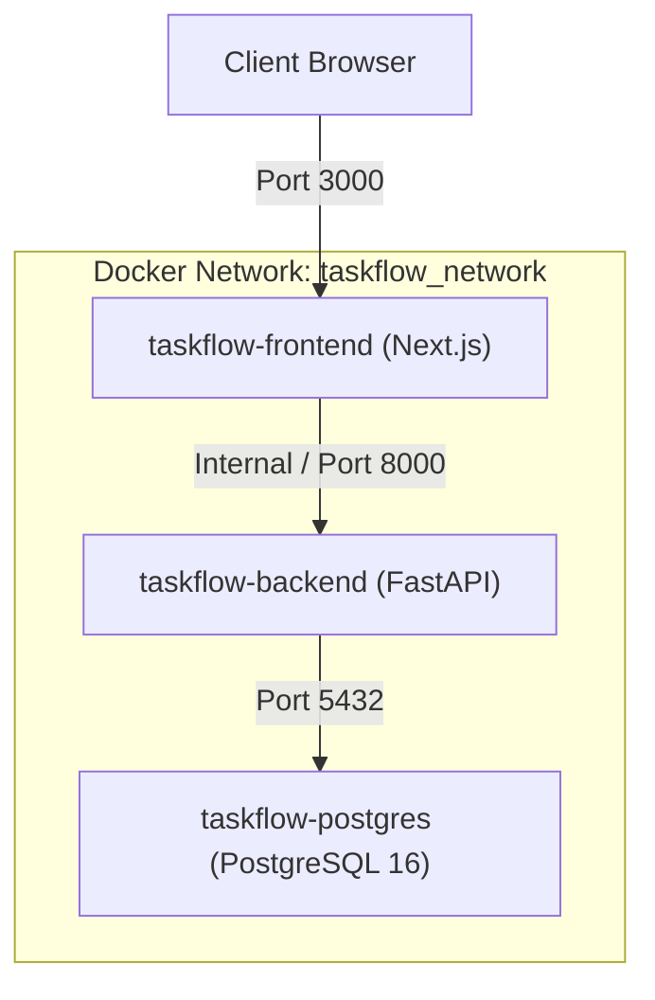

# TaskFlow System Architecture

## 1. Overview & Purpose

**TaskFlow** is a modern, lightweight task management platform engineered specifically to showcase an advanced, production-grade DevOps and CI/CD automation pipeline. While the domain logic is kept concise and understandable, the surrounding engineering practices—containerization, declarative automation, multi-stage security, testing pyramids, and immutable image tagging—represent modern cloud-native standards.

```
       +-------------------------------------------------------------+
       |                        TaskFlow Web                         |
       |                    (Next.js 14 / React / TS)                |
       +------------------------------+------------------------------+
                                      | HTTP / REST
                                      v
       +-------------------------------------------------------------+
       |                       TaskFlow Backend                      |
       |                      (FastAPI / Python 3.11)                |
       +------------------------------+------------------------------+
                                      | Async Connection Pool
                                      v
       +-------------------------------------------------------------+
       |                     PostgreSQL 16 DB                        |
       |                 (Relational Task Persistence)               |
       +-------------------------------------------------------------+
```

---

## 2. Component Design

### 2.1 Backend (FastAPI & SQLAlchemy 2.x)
- **FastAPI Framework:** Asynchronous high-throughput ASGI application exposing `/health` and `/api/tasks`.
- **SQLAlchemy 2.0 Async:** Uses asyncpg connection pool to execute non-blocking database queries.
- **Service Layer Pattern:** Clean separation between routing (`app/api/routes`) and business rules (`app/services/task_service.py`).
- **Pydantic v2 Data Models:** Strict input validation forbidding unexpected or client-manipulated fields (`id`, `created_at`, `updated_at`, `completed_at`).

### 2.2 Relational Data Tier (PostgreSQL 16)
- **Primary Entity:** `Task`
  - `id`: UUID Primary Key generated server-side.
  - `title`: String(255), required.
  - `description`: Text, optional.
  - `status`: Enum (`TODO`, `IN_PROGRESS`, `DONE`), default `TODO`.
  - `priority`: Enum (`LOW`, `MEDIUM`, `HIGH`), default `MEDIUM`.
  - `created_at`: UTC Timestamp, indexed.
  - `updated_at`: UTC Timestamp, automatically updated on every write.
  - `completed_at`: UTC Timestamp, automatically populated when status transitions to `DONE`, and nullified if moved away from `DONE`.
- **Database Migrations:** Versioned via Alembic to guarantee schema idempotency and reversibility.

### 2.3 Frontend (Next.js 14 & Tailwind CSS)
- **Modern SaaS Dashboard:** Real-time KPI summaries (Total, To Do, In Progress, Completed, High Priority).
- **Responsive Layout:** Adaptive user experience across mobile, tablet, and desktop.
- **Robust API Client:** Centralized HTTP layer handling error serialization, timeouts, and state updates.

---

## 3. Container Topology



- **Healthcheck Dependencies:** Backend only initializes after PostgreSQL passes `pg_isready`; Frontend starts after backend passes `/health`.
- **Shared Bridge Network:** Network isolation with internal DNS resolution.
- **Persistent Storage:** Named volume `taskflow_postgres_data` protects against container recreation.
