# TaskFlow CI/CD Pipeline Architecture

## 1. High-Level Flowchart

```mermaid
flowchart TD
    Dev["Developer Git Push"] --> GH["GitHub Repository"]
    GH -->|Webhook / Polling| JK["Jenkins Server"]
    JK --> S1["1. Checkout & Git SHA Extraction"]
    S1 --> S2["2. Tool Validation"]
    S2 --> S3["3. Dependency Installation"]
    S3 --> S4["4. Parallel Quality Checks"]
    S4 --> S5["5. Backend Coverage Gate (>=80%)"]
    S5 --> S6["6. Dependency Security (pip-audit & npm audit)"]
    S6 --> S7["7. Secret Scanning (Gitleaks)"]
    S7 --> S8["8. Integration Environment (CI Compose)"]
    S8 --> S9["9. Real PostgreSQL Integration Tests"]
    S9 --> S10["10. Application Production Build"]
    S10 --> S11["11. Docker Image Build (Git SHA Tagged)"]
    S11 --> S12["12. Container Security (Trivy)"]
    S12 --> S13["13. Docker Hub Registry Push (Main Only)"]
    S13 --> S14["14. Automated Deployment (Docker Compose)"]
    S14 --> S15["15. Health Check Probing"]
    S15 --> S16["16. Automated Smoke Tests (scripts/smoke_test.py)"]
    S16 --> S17["17. Ephemeral CI Resource Cleanup"]
    S17 --> S18["18. Test Reports & Artifact Archiving"]
```

---

## 2. Rationale For Each Pipeline Stage

### 1. Checkout & Metadata Extraction
- **Purpose:** Checks out the exact Git commit and extracts the short Git commit SHA (`GIT_SHA`) and build number (`BUILD_NUMBER`).
- **Why it matters:** Ensures every build artifact has an **immutable, traceable tag** linking container images directly to source code history.

### 2. Tool Validation
- **Purpose:** Verifies that Python, Node.js, npm, Docker, and Docker Compose binaries are present.
- **Why it matters:** Prevents slow failure cycles by failing fast within seconds if runtime agents lack required tooling.

### 3. Dependency Installation
- **Purpose:** Installs backend Python virtualenv wheels and frontend npm packages deterministically (`npm ci`).
- **Why it matters:** Ensures an identical, reproducible dependency baseline for subsequent quality and build stages.

### 4. Parallel Quality Checks
- **Purpose:** Simultaneously executes:
  - Backend Ruff (Linting & Formatter)
  - Backend Unit Tests (Pytest)
  - Frontend ESLint
  - Frontend TypeScript Strict Typecheck (`tsc --noEmit`)
  - Frontend Component Tests (Vitest)
- **Why it matters:** Running independent validation suites concurrently cuts pipeline execution time dramatically without compromising rigor.

### 5. Test Coverage
- **Purpose:** Enforces that backend test coverage is at least 80% (currently **90%**), outputting `coverage.xml` and HTML summaries.
- **Why it matters:** Guarantees untested code or regression gaps cannot slip into production builds.

### 6. Dependency Security (pip-audit & npm audit)
- **Purpose:** Queries PyPA and npm advisory databases to detect known vulnerabilities (CVEs) in third-party libraries.
- **Why it matters:** Defends software supply chain security before code is packaged.

### 7. Secret Scanning (Gitleaks)
- **Purpose:** Scans the codebase for exposed API keys, private keys, tokens, or hardcoded passwords.
- **Why it matters:** Prevents accidental credential leaks from ever persisting into registries or production logs.

### 8. Integration Environment
- **Purpose:** Spins up an isolated CI PostgreSQL database and backend instance via `docker-compose.ci.yml`.
- **Why it matters:** Replicates live operational conditions without polluting or risking local development state.

### 9. Integration Tests
- **Purpose:** Executes live CRUD operations, UUID validation, and query filters against real PostgreSQL.
- **Why it matters:** Unit test mocks can hide database dialect differences, connection pool issues, or migration errors.

### 10. Application Build
- **Purpose:** Compiles Next.js standalone static bundles and validates backend importability.
- **Why it matters:** Identifies compilation errors before container images are generated.

### 11. Docker Build
- **Purpose:** Builds `taskflow-backend:<git-sha>` and `taskflow-frontend:<git-sha>` with multi-stage production Dockerfiles.
- **Why it matters:** Creates minimal, immutable runtime images running non-root users.

### 12. Trivy Vulnerability Scan
- **Purpose:** Performs container vulnerability scanning against base OS layers and installed packages.
- **Why it matters:** Blocks vulnerable container images from reaching registries or production hosts.

### 13. Docker Hub Registry Push (Branch-Aware: Main Only)
- **Purpose:** Pushes Git-SHA-tagged and latest images to Docker Hub using Jenkins credentials `DOCKERHUB_CREDENTIALS`.
- **Why it matters:** Feature branches are validated without releasing images; release images are published only after passing all checks.

### 14. Deployment (Branch-Aware: Main Only)
- **Purpose:** Updates services via `docker compose up -d` using the newly built images.
- **Why it matters:** Automates continuous deployment to target hosting environments.

### 15. Health Check Probing
- **Purpose:** Actively polls `/health` and frontend HTTP responses until services confirm healthy readiness.
- **Why it matters:** Prevents premature smoke testing before services are fully ready to accept traffic.

### 16. Smoke Tests (Branch-Aware: Main Only)
- **Purpose:** Runs `scripts/smoke_test.py` executing a full end-to-end task lifecycle (create, fetch, update, delete).
- **Why it matters:** Verifies runtime functionality in the deployed environment.

### 17. Ephemeral Resource Cleanup
- **Purpose:** Tears down `docker-compose.ci.yml` ephemeral containers, networks, and volumes.
- **Why it matters:** Prevents orphaned CI test containers or dangling volumes from consuming CI server resources.

### 18. Reports & Artifact Archiving
- **Purpose:** Archives JUnit test XML reports (`backend-unit.xml`, `integration-tests.xml`), coverage XML (`coverage.xml`), and HTML coverage dashboards (`htmlcov/**`).
- **Why it matters:** Preserves actionable test analytics and quality metrics across builds.
